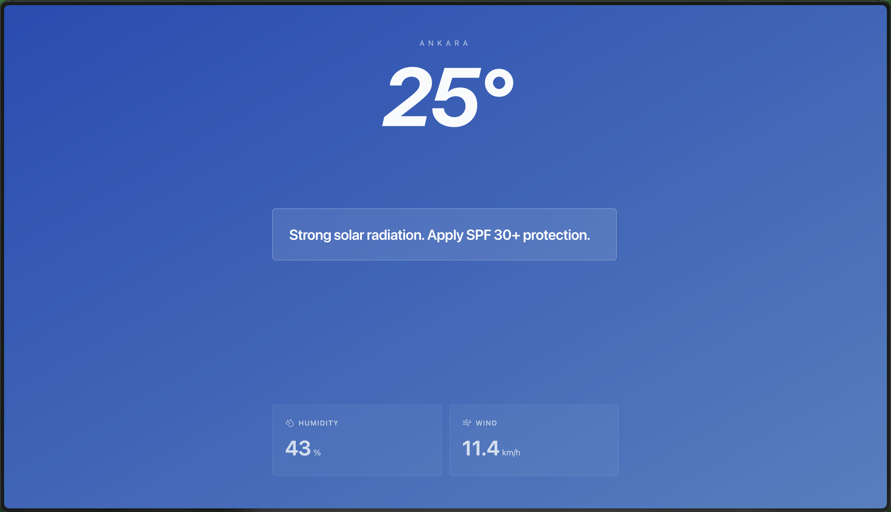

# 🌦️ Weather Insights

A high-performance, minimalist weather application designed to provide instant atmospheric data with zero friction. Built with modern web technologies and deployed on the edge for maximum speed.

**🔗 [Live Demo](https://weather-app-v1.eneszengin542.workers.dev/)**

---

## 🚀 Overview

Weather Insights focuses on **fast insights**. Unlike traditional weather apps cluttered with ads and heavy animations, this tool provides a streamlined, utility-first interface to get you the information you need in seconds.

---

## 📸 Screenshots

| Desktop View | Mobile View |
| :---: | :---: |
|  |  |

---

## 🛠️ Tech Stack

* **Frontend Framework:** [React](https://reactjs.org/)
* **Build Tool:** [Vite](https://vitejs.dev/)
* **Styling:** [Tailwind CSS](https://tailwindcss.com/)
* **APIs Used:** 
  * [Open-Meteo API](https://open-meteo.com/) (Weather Data)
  * [BigDataCloud API](https://www.bigdatacloud.com/) (Reverse Geocoding)
* **Hosting & Deployment:** [Cloudflare Pages/Workers](https://pages.cloudflare.com/)

---

## ⚙️ Installation & Setup

To get a local copy up and running, follow these simple steps:

1. **Clone the repository:**
```bash
   git clone [https://github.com/enszngn/weather-app-v1.git](https://github.com/enszngn/weather-app-v1.git)
   cd weather-app-v1
```
2. **Install the dependencies:**
```bash
   npm install
```
3. **Start the local development server:**
```bash
   npm run dev
```

## 📄 License

This project is licensed under the MIT License - see the [LICENSE](LICENSE) file for details.

---

## ✍️ Contact

Enes Zengin - [GitHub Profile](https://github.com/enszngn)
